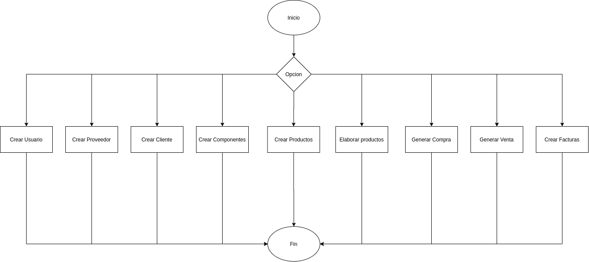
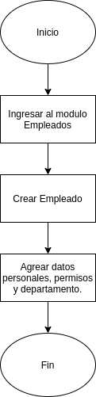
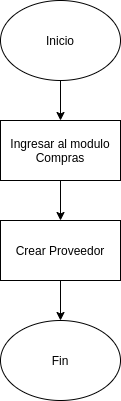
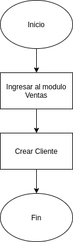
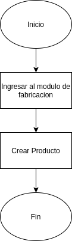
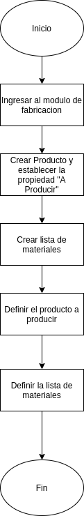
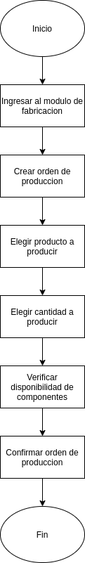
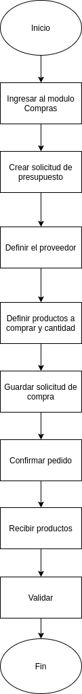
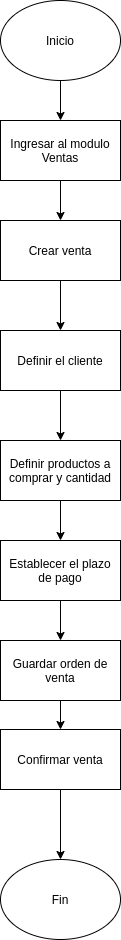
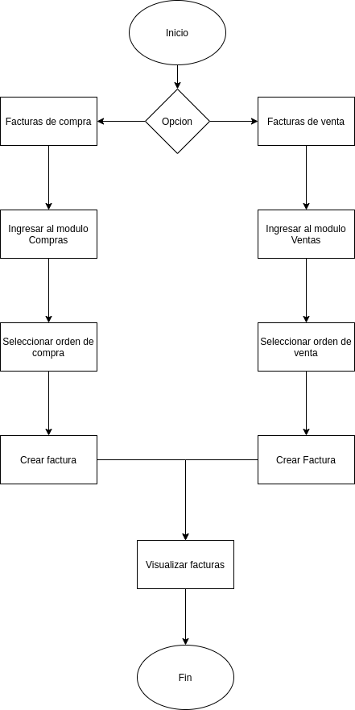

# CompuGamers

## About
Documentación enfocada al plan de mejora del proyecto.

## Tabla de Contenido
> * [Compu Gamers](#compugamers)
>   * [About ](#about)
>   * [Plan de mejora ](#plan-de-mejora)
>       * [Situacion actual de la empresa ](#situacion-actual-de-la-empresa)
>       * [Software propuesto](#software-propuesto)
>       * [Plan](#plan)
>   * [Modulos](#modulos)
>   * [Diagramas de flujo](#diagramas-de-flujo)
>       * [Diagrama General](#diagrama-general)
>       * [Empleados](#empleados)
>       * [Proveedores](#proveedores)
>       * [Clientes](#clientes)
>       * [Componentes](#componentes)
>       * [Productos](#productos)
>       * [Fabricacion de productos](#fabricacion-de-productos)
>       * [Ordenes de compra](#ordenes-de-compra)
>       * [Ordenes de venta](#ordenes-de-venta)
>       * [Facturas](#facturas)

## Plan de mejora

### Situación actual de la empresa
CompuGamers es una empresa en busca de mejorar su posición en el mercado a los mas alto. La empresa se dedica al ensamblaje de equipos de cómputo y desean mejorar su situación actual.

Actualmente la empresa utiliza dos softwares para el manejo de sus procesos y el resto lo realiza mediante archivos de excel sin tener un control claro sobre los procesos. Adicionalmente algo que cabe la pena mencionar es que la empresa actualmente gestiona a 500 empleados.

### Software propuesto
Dada la situación de la empresa se propone el uso de Odoo. Odoo es un software empresarial todo en uno que incluye CRM, sitio web y comercio electrónico, facturación, contabilidad, fabricación, gestión de almacenes y proyectos, e inventario entre otros. 

Cuenta con una versión Community, la cuál es de código abierto y gratuita, por lo que se propone el uso de este software con esta versión y familiarizarse con la herramienta. Si hay unan respuesta positiva al uso de la herramienta ya se implementa la versión Enterprise.

Otra se las razones por las que se propone Odoo es por su fácil instalación y configuración, las instalaciones de módulos es bastante sencilla y la personalización también. Es amigable con el usuario, muy robusta y de uso fácil.

### Plan
Teniendo en cuenta los factores anteriores y la herramienta a utilizar se propone un plan de mejora que consiste en lo siguiente:

1. Control de clientes
2. Control de proveedores
3. Inventario de materia prima
4. Inventario de productos ensamblados
5. Control de ventas
6. Control de compras
7. Facturaciones de compras y ventas
8. Control de empleados
9. Comunicación entre empleados

Con los puntos establecidos, se propone un plan que consiste en 4 fases para la implementación del nuevo software.

* **Fase 1:** Consiste en la instalación del nuevo sistema en la empresa.
* **Fase 2:** Capacitación a los empleados para el uso del nuevo sistema.
* **Fase 3:** Pruebas de parte de los empleados en el software en su versión Community.
* **Fase 4:** Configuración del software en su versión Enterprise como sistema final.

## Modulos

* Compras
* Ventas
* Facturación / Contabilidad
* Inventario
* Recursos Humanos

## Diagramas de flujo

### Diagrama General

### Empleados

### Proveedores

### Clientes

### Componentes

### Productos

### Fabricacion de productos

### Ordenes de compra

### Ordenes de venta

### Facturas
