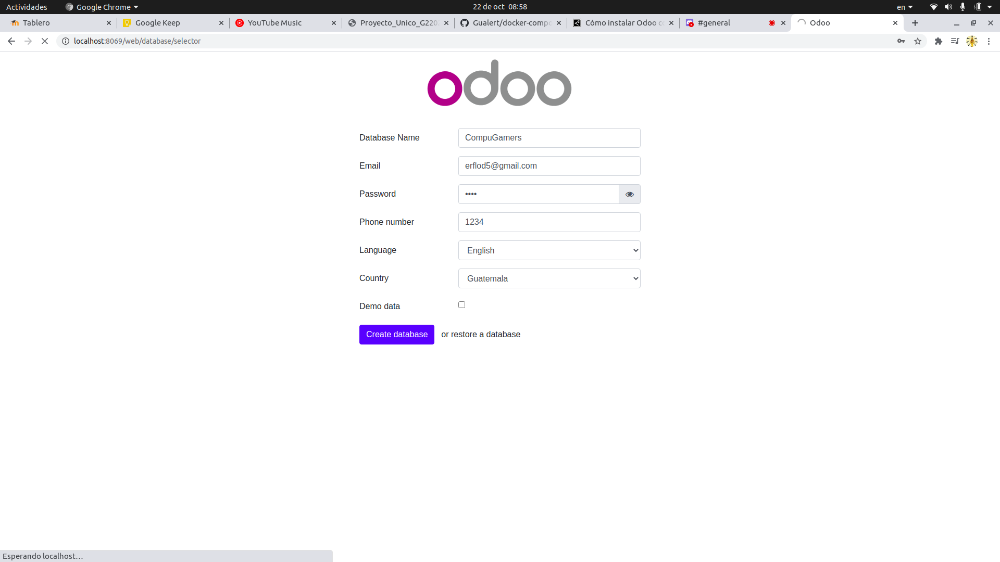
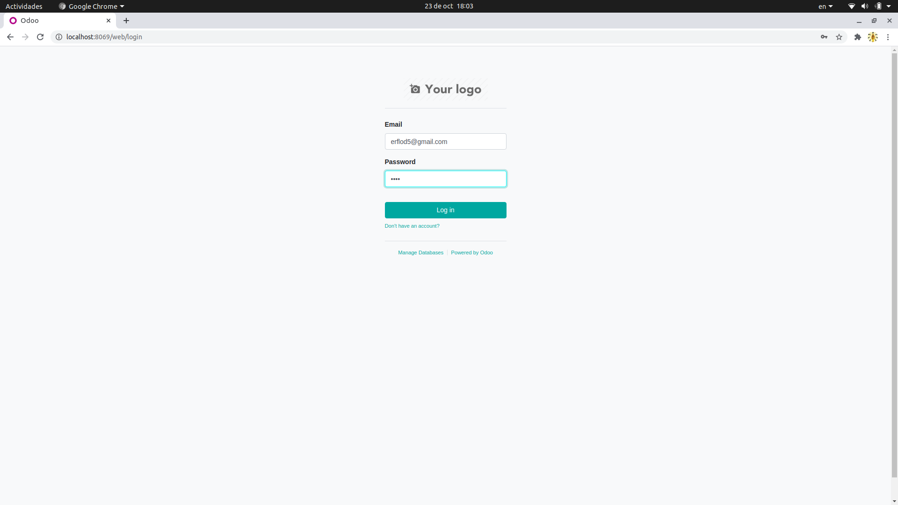
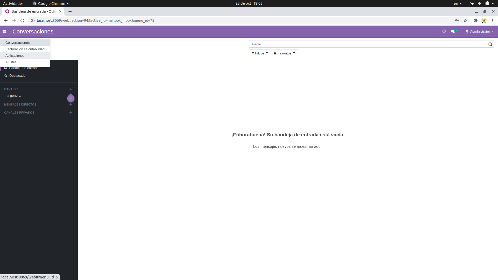
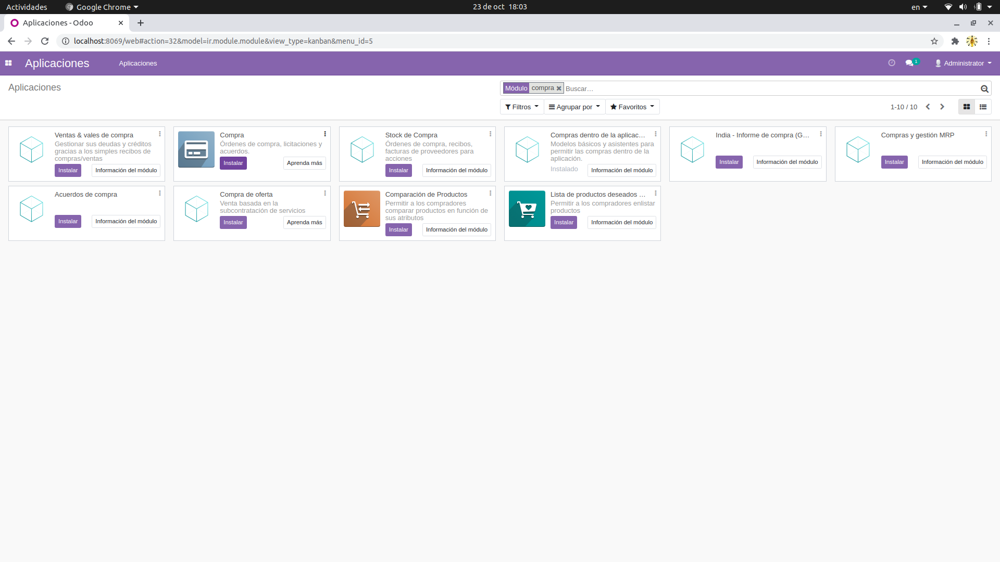
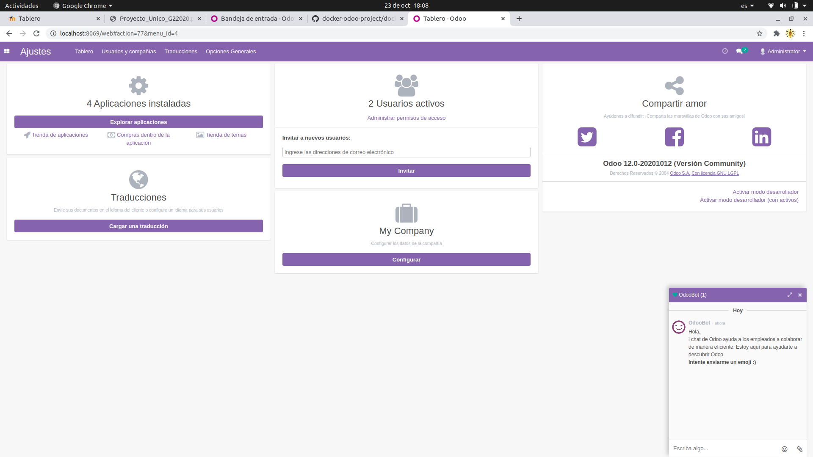
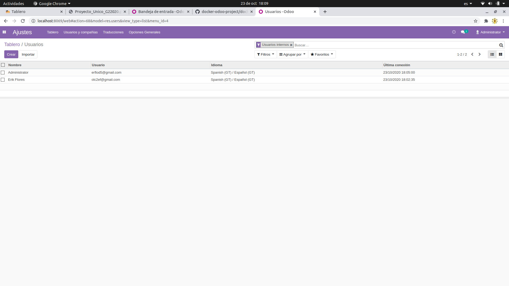
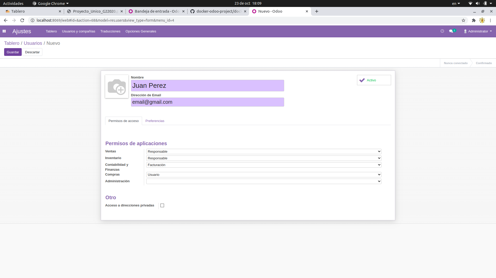
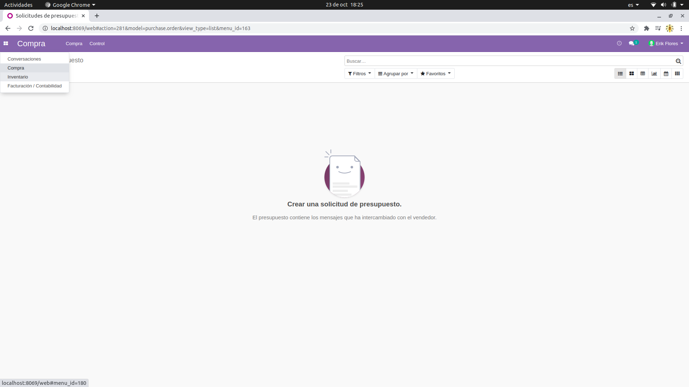

# CompuGamers
Proyecto final Sistemas Organizacionales Y Gerenciales 2

## Prerrequisitos
* Docker
* Docker Compose

## Instalación de Odoo

1. Configurar el archivo **docker-compose.yml**
    ```yml
        version: '3'
        services: 
            odoo:
                image: odoo:12.0
                container_name: Odoo
                restart: always
                links: 
                    - db
                ports: 
                    - "8069:8069"
            
            db:
                image: postgres:10
                container_name: Postgres
                restart: always
                environment: 
                    - POSTGRES_DB=postgres
                    - POSTGRES_PASSWORD=odoo
                    - POSTGRES_USER=odoo
    ```

2. Correr en consola el comando ``docker-compose up -d``

## Configuar base de datos en Odoo

1. Abrir en el navegador la url **http://localhost:8069**
2. Llenar el formulario
    

3. Crear database

## Instalacion de modulo

1. Iniciar sesión con un usuario administrador
    

2. En el menú principal, seleccionar la opción **Aplicaciones**
    

3. Buscar el módulo a instalar y darle click en Instalar.
    

## Crear Usuarios
1. Iniciar sesión con un usuario administrador
    

2. En el menú principal, seleccionar la opción **Ajustes**
    

3. En ajustes, click en **Administrar permisos de acceso**
    

4. Se muestran la lista de usuarios del sistema, click en **Crear** para crear un nuevo usuario
    

5. Llenar los campos solicitados y asignarle los permisos al usuario creado.
    

## Acceso a módulos
1. Iniciar sesión como usuario normal
    

2. En la parte izquierda se muestran los módulos a los que tiene acceso.
    


## Contribuidores
- [Erik Flores](https://github.com/erflod5) <br> 201701066

## Licencia
Este proyecto está desarrollado bajo la [Licencia MIT](LICENSE).

